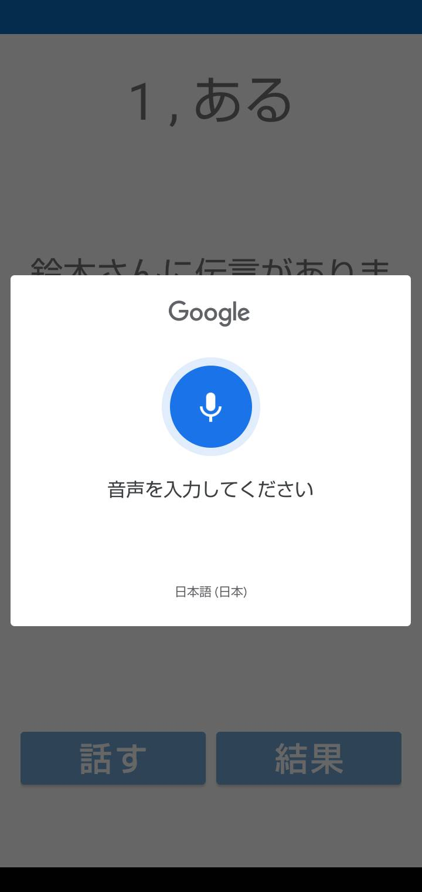

# 敬語トレーニング
専門学校1年後期で作成したAndroidアプリです。4人チームで作成しました。
このリポジトリにはJavaファイルしかアップしていないため、このままでは動作しません。

## アプリ概要
これは、敬語の練習を学習するためのクイズ型アプリです。既存のアプリとは違い、問題に解答するときは声に出して解答します。問題の種類は丁寧語、尊敬語、謙譲語から選ぶことができます。

## 使用技術
- Java
- Android Studio
- Firebase
    - Firestore
    - Firebase Authentication
- Google Speech to Text API
- gooラボ ひらがな化API

## 担当場所
Firebaseと細かい機能の作成、単体機能結合を担当しました。

## エピソード
専門学校に入るまでプログラミングの経験がなく人生初めてのアプリ開発ということもあり、かなり苦労しました。まずAPIがどのようなものかよく理解しておらず、実装に時間がかかりました。HTTPでリクエストを送信する処理も、リクエストボディの記述方法をチーム全員で探しました。

トップ

問題出題

音声認識で解答

結果
